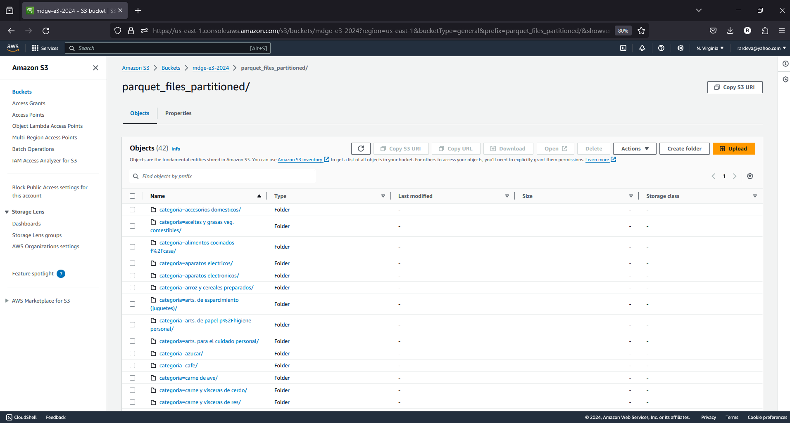
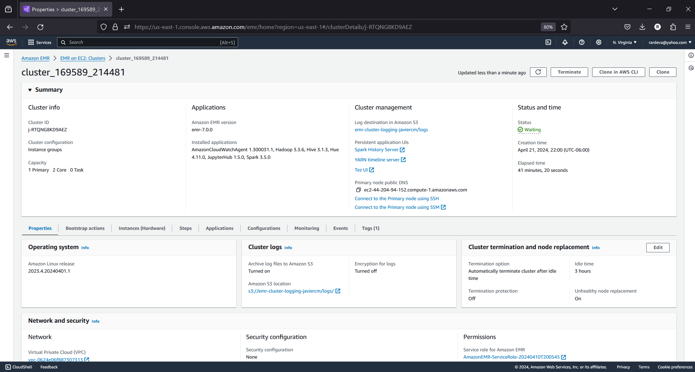
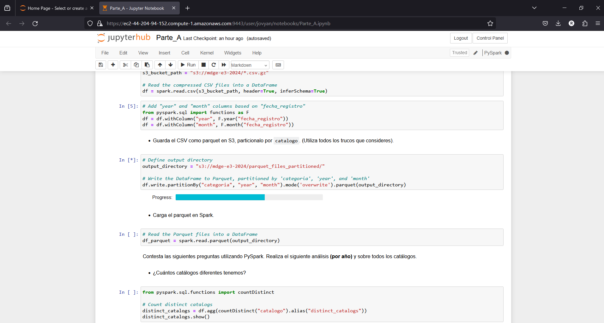

# Proyecto parcial

2024-04-20 12:09:08

Proyecto parcial de la materia de métodos de gran escala en el semestre enero a mayo 2024

## Datos del equipo

Equipo: 3

Integrantes:

|Nombre|Matrícula|Correo
|-|-|-
|Horus Ordoñez|214481|[hordonez.act@gmail.com](mailto:hordonez.act@gmail.com)
|Javier Castillo Millán|169589|[jcasti71@itam.mx](mailto:jcasti71@itam.mx)

## Asignación

La asignación del equipo está relacionada a la categoría de precios (catálogo) que debe tomar el equipo.

Para el equipo 3 fue Material escolar

## Instrucciones de la Tarea

Las instrucciones pueden encontrarse en el archivo [tarea.md](tarea.md)

## Ejecución

El proyecto está dividido en 3 archivos:

- [Limpieza de datos](ETL.ipynb)
- [Parte A - Spark](Parte_A.ipynb)
- [Parte B - Athena](Parte_B.ipynb)

## Entregables

- Un screenshot de cómo guardaste los archivos en S3, donde se puedan ver
las particiones.
  - 
- Un screenshot del dashboard del cluster, donde se vea el nombre, el id del cluster, el DNS, y el tiempo de ejecución.
  - 
- Un screenshot del JupyterHub, donde se vea la dirección DNS (El URL).
  - 
- Un screenshot de la consola de Athena donde se vea la base de datos y la tabla de Profeco.
  - 
- Un cuaderno ejecutado con los resultados y el código. El cuaderno debe de
incluir cada pregunta y su respuesta. El cuaderno puede ser un ipynb, un RMD o un quarto, o un PDF.
  - [Parte A - Spark](Parte_A.ipynb)
  - [Parte B - Athena](Parte_B.ipynb)
